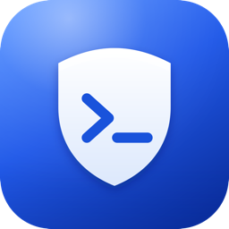

<div align="center">
  

  # PortGuard

  A lightweight macOS menu bar app that watches your development ports and kills the ones you forgot about.

  [](https://github.com/okutaybozkurt/PortGuard/actions/workflows/ci.yml)
  [](LICENSE)
  
  
</div>

## Why

Every `npm run dev`, `vite`, `flutter run`, `uvicorn`, or `docker` you start keeps running in the background long after you've closed the terminal or switched projects. Over a day that adds up to gigabytes of idle RAM, a warmer laptop, and the occasional `EADDRINUSE: address already in use` when you try to start something new on a port you thought was free.

PortGuard sits in your menu bar, shows you exactly which process is listening on which port and how much RAM/CPU it's using, and lets you kill it with one click.

## Features

- **Live port monitoring** — polls `lsof`/`ps` on an interval you control (2–30s) and shows every listening TCP port.
- **Dev-process filtering** — recognizes common dev tooling (Node, Python, Dart/Flutter, Java, Go, Ruby, Docker, Postgres, Redis, Vite, webpack, and more) and hides system services (`launchd`, `ControlCenter`, `rapportd`, …) by default.
- **Uptime tracking** — shows how long each process has been listening (`3g 4s`, `45dk`, …) and flags anything open for 1+ day, so a forgotten background process is obvious at a glance instead of just another row in the list.
- **Custom filters** — add your own process names to the allow-list from Settings.
- **One-click kill** — terminate a runaway process straight from the menu bar popover or the full dashboard window.
- **RAM alerts** — get a native macOS notification when a dev process crosses a memory threshold you set.
- **No telemetry, no network access** — PortGuard never makes a network request. It only shells out to `lsof`, `ps`, and `kill`.

## Installation

### Option 1 — Download a release (recommended for most users)

1. Grab the latest `PortGuard-Installer.dmg` from the [Releases](https://github.com/okutaybozkurt/PortGuard/releases) page.
2. Open the `.dmg` and drag **PortGuard.app** into `/Applications`.
3. **First launch:** PortGuard isn't (yet) notarized by Apple, so Gatekeeper will refuse to open it with a plain double-click. Instead:
   - Right-click (or Control-click) `PortGuard.app` → **Open** → **Open** again in the dialog, **or**
   - Go to **System Settings → Privacy & Security**, scroll down, and click **Open Anyway** next to the PortGuard warning.

   You only need to do this once.

### Option 2 — Build from source

Requirements: **macOS 13+** and **Xcode 15 / Swift 5.9+**.

```bash
git clone https://github.com/okutaybozkurt/PortGuard.git
cd PortGuard
bash scripts/build_app.sh
open dist/PortGuard.app
```

`scripts/build_app.sh` produces three artifacts in `dist/`:

- `PortGuard.app` — ready to run or drag into `/Applications`
- `PortGuard-macOS.zip`
- `PortGuard-Installer.dmg`

Prefer to just run it without packaging?

```bash
swift run
```

## Development

```bash
swift build          # debug build
swift test            # run the full test suite (unit + security invariants)
swift build -c release
```

The test suite includes dedicated **security tests** (`Tests/PortGuardTests/SecurityTests.swift`) that assert PortGuard's core safety invariants — for example, that `kill`/`lsof`/`ps` are always invoked via absolute paths with array-based arguments (never a shell string), and that a system-critical process can never be relabeled as "safe to kill" through user-supplied custom keywords. CI runs `swift build` and `swift test` on every push and pull request (see `.github/workflows/ci.yml`).

### Project structure

```
PortGuard/
├── App/              # App entry point (MenuBarExtra + main window)
├── Core/              # Protocols + the single shell command executor
├── Models/            # PortProcess, ProcessMetrics
├── Services/          # ProcessManager, output parsing, dev-process filtering
├── ViewModels/        # PortMonitorEngine (ObservableObject)
└── Views/             # SwiftUI views and components
Tests/PortGuardTests/  # Unit + security tests
```

The architecture follows a Facade (`ProcessManager`) over small, swappable strategies (`CommandExecutorProtocol`, `LsofOutputParsingProtocol`, `ProcessFilterStrategyProtocol`), so every shell interaction can be mocked in tests without touching the real system.

## Security

PortGuard runs entirely locally and needs no special permissions beyond what any user process already has:

- Every external command (`lsof`, `ps`, `kill`) is invoked via an absolute path with an array of arguments — never through a shell string, so there is no command-injection surface.
- `kill -9` only ever targets PIDs the app itself discovered via `lsof`; since it doesn't run as root, the OS itself prevents it from touching processes you don't own.
- No network requests, no analytics, no crash reporting — nothing leaves your machine.

If you find a security issue, please open a private report via [GitHub Security Advisories](https://github.com/okutaybozkurt/PortGuard/security/advisories/new) rather than a public issue.

## Roadmap

- [ ] Apple Developer notarization for a Gatekeeper-friendly first launch
- [ ] Homebrew Cask distribution
- [ ] English localization (UI is currently Turkish-only)
- [ ] Menu bar icon color/badge themes

## Contributing

Issues and pull requests are welcome. Please run `swift test` before opening a PR.

## License

[MIT](LICENSE) — © 2026 Orhan Kutay Bozkurt
