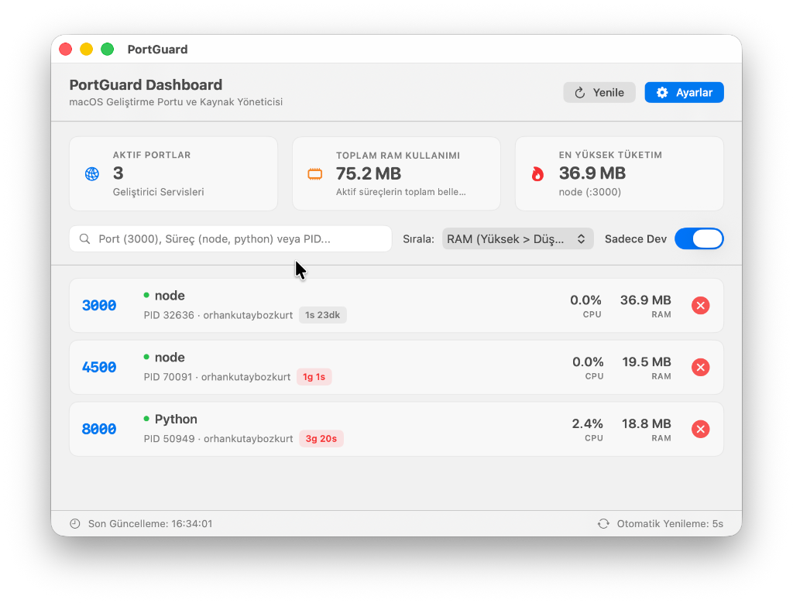
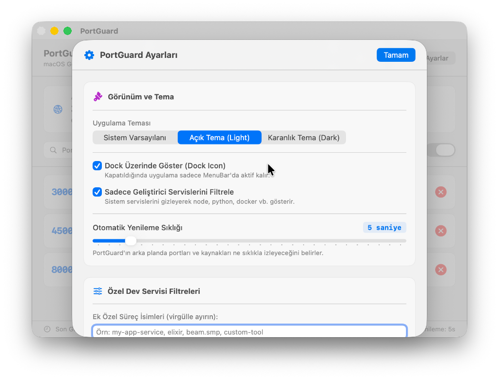
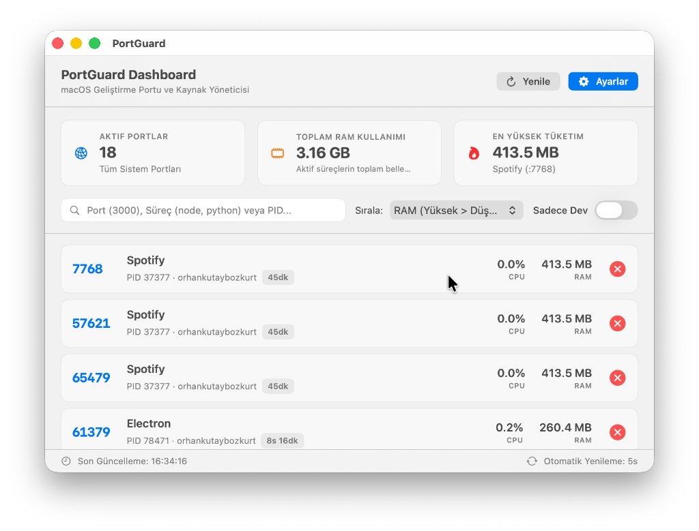

# PortGuard

> **macOS MenuBar Port & Resource Monitor** — Geliştirici portlarını (Node, Python, Docker, Go, Flutter vb.) anlık izleyen, RAM/CPU kullanımını gösteren ve tek tıkla süreç sonlandıran ultra hafif macOS uygulaması.


---

## Problem ve Çözüm

### Problem
Yazılım geliştiriciler gün içerisinde `npm run dev`, `flutter run`, `vite`, `docker`, `python uvicorn` gibi birçok geliştirme sunucusu çalıştırır. Terminal sekmeleri kapatıldığında arka planda açık unutulan bu portlar:
- Ciddi oranda **RAM (1 - 4 GB+)** ve **CPU (%15 - %30+)** tüketir.
- Mac cihazlarda **pil ömrünü hızlıca tüketir** ve cihazın ısınmasına neden olur.
- Yeni bir proje başlatıldığında `EADDRINUSE: address already in use` port çakışması hatasına yol açar.

### Çözüm: PortGuard
PortGuard; macOS sistem çubuğunda (MenuBar) ve ana pencerede (Dashboard) çalışan, arka planda geliştirici portlarını tarayarak hangi servisin hangi portu kullandığını, ne kadar RAM/CPU tükettiğini gösteren ve tek tıkla ilgili süreci güvenle sonlandırmaya (`kill -15`) yarayan hafif ve şık bir uygulamadır.

---

## Öne Çıkan Özellikler

- **Anlık Port ve PID Tespiti:** `/usr/sbin/lsof` ve `/bin/ps` entegrasyonu ile dinlenen tüm TCP portlarını milisaniyeler içinde listeler.
- **Canlı RAM & CPU Takibi:** Süreç bazlı gerçek zamanlı RAM (MB/GB) ve CPU (%CPU) kullanımını gösterir.
- **Tek Tıkla veya Toplu Süreç Sonlandırma:** Çakışan veya fazla kaynak tüketen servisleri güvenle sonlandırır (`kill -15`). Birden fazla port seçilerek tek seferde (Batch Kill) durdurulabilir.
- **Dinamik Dil Desteği:** Ayarlar üzerinden uygulamayı yeniden başlatmadan anında Türkçe veya İngilizce arayüze geçiş yapabilirsiniz.
- **Süreç Bilgi Asistanı:** Servislerin yanındaki bilgi ikonuna tıklayarak uygulamanın tam olarak ne işe yaradığını açıklayan dinamik ipuçları alabilirsiniz.
- **Otomatik Güncelleme Denetleyici:** Ayarlar sekmesinden GitHub üzerindeki yeni sürümleri otomatik kontrol eder ve anında indirme sayfasına yönlendirir.
- **Yüksek RAM Tüketim Uyarısı:** 1 GB (veya belirlediğiniz eşiği) aşan servisler için macOS sistem bildirimi gönderir.
- **Özgün Apple HIG Arayüzü:** Translucent (Buzlu Cam / Material) doku, Açık Tema (Light Mode), Karanlık Tema (Dark Mode) ve Sistem Varsayılanı desteği.
- **Geliştirici Filtresi:** Sistem servislerini gizleyerek sadece geliştirme araçlarına (`node`, `python`, `docker`, `dart`, `java`, `go`, `ruby`, `vite` vb.) odaklanır. Özel whitelist eklenebilir.

---

## Ekran Görüntüleri

| Sadece Geliştirici Servisleri (Dev Mode) | Ayarlar Paneli (Settings) |
| :---: | :---: |
|  |  |
| *Yalnızca Node, Python, Docker vb. geliştirici araçlarını gösterir.* | *Kalıcı ayarlar, RAM sınırları, yenileme hızı ve tema yönetimi.* |

| Tüm Süreçler (Masaüstü Uygulamaları Dahil) |
| :---: |
|  |
| *"Sadece Dev" filtresi kapatıldığında Spotify, Chrome gibi tüm masaüstü uygulamalarının aktif portları listelenir.* |

---

## Kurulum ve Kullanım (How to Install & Run)

PortGuard'ı kullanmak için iki farklı yöntem bulunmaktadır:

### Yöntem 1: Hazır Kurulum Paketini İndirme (.dmg - Önerilen)

1. GitHub Releases sayfasından veya `dist/PortGuard-Installer.dmg` dosyasını bilgisayarınıza indirin.
2. İndirdiğiniz `.dmg` dosyasına çift tıklayın.
3. `PortGuard.app` simgesini **Applications (Uygulamalar)** klasörüne sürükleyip bırakın.
4. Uygulamayı çalıştırın. PortGuard menü çubuğunuzda ve Dock üzerinde aktifleşecektir.

> **⚠️ Önemli Not (Bilinmeyen Geliştirici Uyarısı):**
> PortGuard açık kaynaklı bağımsız bir proje olduğundan, ilk açılışta macOS güvenlik duvarı (Gatekeeper) *"PortGuard açılamıyor çünkü geliştiricisi doğrulanamıyor"* uyarısı verebilir. 
> **Çözüm:** Uygulamalar klasöründeki PortGuard ikonuna **Sağ Tıklayıp -> Aç (Open)** diyerek veya `Sistem Ayarları -> Gizlilik ve Güvenlik` menüsünden **"Yine de Aç"** butonuna tıklayarak güvenle kullanmaya başlayabilirsiniz.

---

### Yöntem 2: Kaynak Koddan Derleme (Developer Build)

PortGuard projesini kendi bilgisayarınızda derleyip çalıştırmak isterseniz:

1. **Repoyu klonlayın:**
   ```bash
   git clone https://github.com/okutaybozkurt/PortGuard.git
   cd PortGuard
   ```

2. **Testleri çalıştırın:**
   ```bash
   swift test
   ```

3. **Uygulamayı derleyin ve paketleyin:**
   ```bash
   chmod +x scripts/build_app.sh
   ./scripts/build_app.sh
   ```
   *Derlenen `.app` paketi ve `.dmg` kurulum kalıbı `dist/` klasörü içerisine oluşturulacaktır.*

4. **Uygulamayı çalıştırın:**
   ```bash
   open dist/PortGuard.app
   ```

---

### Yöntem 3: Terminalden Kurulum / Güncelleme

Tarayıcı açıp `.dmg` indirmeden, doğrudan terminalden kurmak veya var olan bir kurulumu güncellemek için:

1. **Çalışan sürümü kapatın:**
   ```bash
   killall PortGuard 2>/dev/null
   ```

2. **En son sürümü indirin:**
   ```bash
   curl -L -o ~/Downloads/PortGuard.zip https://github.com/okutaybozkurt/PortGuard/releases/latest/download/PortGuard-macOS.zip
   ```

3. **Arşivi çıkarın:**
   ```bash
   unzip -o ~/Downloads/PortGuard.zip -d ~/Downloads
   ```

4. **Applications klasörüne kurun:**
   ```bash
   rm -rf /Applications/PortGuard.app
   mv ~/Downloads/PortGuard.app /Applications/PortGuard.app
   ```

5. **Karantina bayrağını temizleyin ve başlatın:**
   ```bash
   xattr -dr com.apple.quarantine /Applications/PortGuard.app
   open /Applications/PortGuard.app
   ```

Tüm adımları tek satırda çalıştırmak isterseniz:

```bash
killall PortGuard 2>/dev/null; curl -L -o ~/Downloads/PortGuard.zip https://github.com/okutaybozkurt/PortGuard/releases/latest/download/PortGuard-macOS.zip && unzip -o ~/Downloads/PortGuard.zip -d ~/Downloads && rm -rf /Applications/PortGuard.app && mv ~/Downloads/PortGuard.app /Applications/PortGuard.app && xattr -dr com.apple.quarantine /Applications/PortGuard.app && open /Applications/PortGuard.app
```

`releases/latest/download/...` adresi her zaman en güncel sürüme işaret eder; yeni bir sürüm yayınlandığında komut değişmeden aynı şekilde çalışır.

---

## Mimari ve Tasarım Prensipleri

PortGuard, **SOLID prensipleri**, **Clean Code standartları** ve **Yazılım Tasarım Kalıpları (Design Patterns)** ile geliştirilmiştir:

- **Single Responsibility Principle (SRP):** Komut çalıştırma (`ShellCommandExecutor`), çıktı ayrıştırma (`LsofOutputParser`) ve filtreleme (`DevProcessFilter`) bağımsız sınıflara bölünmüştür.
- **Open/Closed Principle (OCP) & Strategy Pattern:** Filtreleme kuralları `ProcessFilterStrategyProtocol` ile esnek hale getirilmiştir.
- **Dependency Inversion (DIP) & Dependency Injection (DI):** `PortMonitorEngine` ViewModel'i protokollere bağımlıdır, %100 izole unit test edilebilirliğe sahiptir (`MockCommandExecutor`).
- **Facade Pattern:** `ProcessManager`, tüm arka plan işlemlerini tek bir sade API arkasında koordine eder.

---

## Güvenlik ve Gizlilik (Security & Privacy Audit)

**Yerel Çalışma, Minimal Ağ Erişimi, Sıfır Telemetri:**
- Port/RAM/CPU izleme tamamen yerel çalışır — bilgisayarınızdaki macOS sistem komutları (`/usr/sbin/lsof`, `/bin/ps`) üzerinden gerçekleştirilir, hiçbir veri dışarı gönderilmez.
- PortGuard'ın yaptığı **tek** ağ isteği, Ayarlar'daki "Güncellemeleri Denetle" butonuna tıklandığında GitHub'ın herkese açık Releases API'sine (`api.github.com/repos/okutaybozkurt/PortGuard/releases/latest`) atılan, en son sürümü öğrenmeye yönelik istektir. Bu istek otomatik/arka planda çalışmaz, yalnızca kullanıcı butona bastığında tetiklenir.
- Analitik, çökme raporlama veya kullanım takibi (telemetri) yoktur.
- Proje içerisinde hiçbir API anahtarı, gizli şifre veya harici kimlik bilgisi (credentials/secrets) bulunmamaktadır.

---

## Lisans

Bu proje **MIT Lisansı** ile lisanslanmıştır. Detaylar için [LICENSE](LICENSE) dosyasına göz atabilirsiniz.

*Geliştirici:* [Orhan Kutay Bozkurt](https://github.com/okutaybozkurt)
